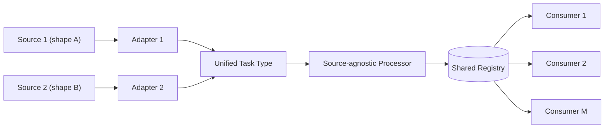
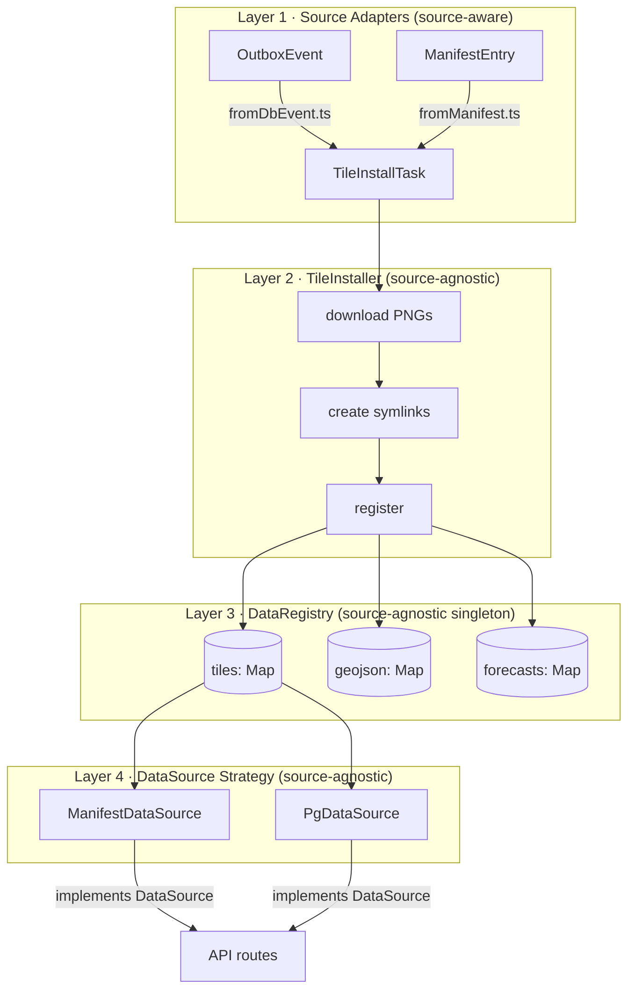

## The General Problem

Strip away the tiles and forecasts and the shape underneath is generic: M consumer call sites
need N data types, and each data type can be produced by more than one independent upstream
source, each with its own event or payload shape. Left to grow organically, the naive fix is a
fallback branch at every call site — an **M × N × (source count)** surface area, where each
branch also has to encode which source to trust first and how to resolve partial failures.



The fix: push every bit of source-specific knowledge into a thin adapter boundary, converge
everything on one shared intermediate type, and let every consumer read from a single
source-agnostic registry. Adding a source means adding one adapter — it never touches a
consumer. This shape holds regardless of whether the "sources" are payment webhooks, auth
providers, message brokers, or — the concrete case below — a Postgres outbox and an S3
manifest feed.

## A Concrete Instance

Here's one instantiation of that shape: a Next.js application I maintain that renders
geospatial map tiles and time-series forecast data. The app ingests tile images, GeoJSON
clusters, and forecast parquet files from two completely independent data sources:

| Source          | How it works                                     | Event shape                                 |
| --------------- | ------------------------------------------------ | ------------------------------------------- |
| **PG Outbox**   | PostgreSQL `LISTEN/NOTIFY` + 5-min cron catch-up | `OutboxEvent` with flat `variables[]`       |
| **S3 Manifest** | S3 polling with ETag (30s interval)              | `ManifestEntry` with nested `tile_groups[]` |

Both sources ultimately do the same thing: download tile PNGs from S3, create symlinks for web serving, download GeoJSON clusters, and register the data so API routes can find it. The manifest path also downloads Hive-partitioned parquet files for DuckDB queries.

The two sources existed because they evolved at different times. The PG outbox was the original real-time notification mechanism. The S3 manifest was added later as a more robust, eventually-consistent alternative that doesn't depend on a persistent database connection.

## The Problem

When I started planning the manifest integration, the obvious approach was a try/catch fallback in every API route:

```typescript
// This pattern × 5 routes × 3 data types = pain
try {
  data = await manifestSource.getTiles();
} catch {
  data = await pgSource.getTiles();
}
```

I had five API routes, three data types (tiles, GeoJSON, forecasts), and the fallback pattern would need to appear in every combination. Worse, each route would need to know _which_ source to try first, handle partial failures, and deal with the case where both sources have data but from different model runs.

The second problem was subtler. Each source had its own way of tracking "what data is locally available":

- DB events wrote to a `location_images` PostgreSQL table
- Manifest updates wrote to a `LocalSyncState` JSON file

API routes had to know which one to query. If I ever added a third source, I'd be touching every route again.

The third problem was the download logic itself. `downloadTilesFromEvent()` and `downloadFromManifestEntry()` each decomposed their source-specific types into the same `downloadTilesToStableDir()` + `createVariableSymlink()` calls. Two parallel code paths doing identical work with different input shapes.

## Design Principles

Before writing any code, I set a few rules. None of these are specific to tiles or forecasts —
they generalize to any system where more than one upstream can produce the same logical
entity:

**Source blindness.** Everything downstream of the adapter layer must be source-agnostic. Zero `if (source === 'db')` in shared code. The two adapter files are the _only_ place that knows about event shapes.

**Registry as truth.** API routes read from one in-memory registry. Never query PG tables or manifest state files directly for "what's available."

**Idempotent install.** Installing the same data from both sources simultaneously must be a no-op. No locks, no distributed coordination. The registry handles deduplication internally.

**One source at startup.** Based on configuration, register exactly one `DataSource` implementation. No runtime source switching, no fallback chains. The operator decides which source to trust.

## The Architecture

The solution composes four well-known roles into four layers, each with a single
responsibility — an **Adapter** boundary, a source-agnostic **Orchestrator**, a shared
**Registry**, and a **Strategy** interface:



### Layer 1: Adapters

This is the **Adapter** boundary — the only place allowed to know a source's native shape.
Concretely, each adapter here is a pure function that converts a source-specific type into the
shared `TileInstallTask`:

```typescript
// fromDbEvent.ts — the ONLY file that knows about OutboxEvent
export function toInstallTask(event: OutboxEvent): TileInstallTask {
  const payload = event.payload as TileUploadCompletedPayload;
  return {
    modelId: payload.ctx.model_id,
    rename: extractRename(payload.ctx.s3_path),
    dateHour: payload.ctx.date_hour,
    s3Path: payload.ctx.s3_path,
    groups: [{ variables: payload.ctx.variables, ... }],
    source: 'db-event',
  };
}
```

The manifest adapter does the same conversion from `ManifestEntry`. After this point, the rest of the pipeline doesn't know or care where the data came from.

### Layer 2: TileInstaller

This is the source-agnostic **Orchestrator** — it sequences the real work using only the
shared type, with zero knowledge of which source the task came from. Concretely, it takes a
`TileInstallTask` and does four things:

1. Download tile PNGs from S3 to a stable directory (content-addressed by variable name, not by model run)
2. Create a randomized symlink under `rdm/` for web serving (so URLs don't expose internal structure)
3. Register the tile in DataRegistry with metadata
4. Clean up old forecast datetime folders

The key design decision: **the installer doesn't own the download logic.** It delegates to `downloadTilesToStableDir()`, which already existed. The installer is a coordinator that sequences the download → symlink → register steps and handles the symlink lifecycle.

### Layer 3: DataRegistry

This is the shared **Registry** — the one place every consumer reads "what's currently
available," and the place that owns conflict resolution when more than one source reports the
same logical entity. Concretely, it's an in-memory singleton on `globalThis` (necessary
because Next.js Turbopack evaluates modules in separate contexts — a module-level variable
would be duplicated across API routes and instrumentation code).

The interesting part is source-priority deduplication. When both sources are enabled, the same tile might be registered twice — once from a DB event and once from the manifest. The registry resolves conflicts:

```typescript
private shouldAccept(existing: TileRecord | undefined, incoming: TileRecord): boolean {
  if (!existing) return true;
  if (incoming.dateHour > existing.dateHour) return true;  // newer data wins
  if (incoming.dateHour === existing.dateHour) {
    return SOURCE_PRIORITY[incoming.source] >= SOURCE_PRIORITY[existing.source];
  }
  return false;
}
```

The priority ordering is: **manifest > db-event**. The manifest represents a complete, validated snapshot published by the upstream pipeline. A DB event is an incremental, real-time notification that might arrive before all files are fully uploaded. When both report the same `dateHour`, the manifest record is authoritative.

In practice, we only enable one source at a time. But the priority logic means the system is correct even if both are accidentally enabled.

### Layer 4: DataSource Strategy

This is the **Strategy** interface — the seam consumers call through, decided once at startup
and never branched on again. Concretely, API routes call `getGlobalDataSource()` and get back
whichever implementation was registered at startup:

```typescript
// instrumentation.ts — runs once at process start
if (isManifestSyncEnabled()) {
  setGlobalDataSource(
    new ManifestDataSource(registry, forecastStore, tideStore),
  );
} else {
  setGlobalDataSource(new PgDataSource(registry));
}
```

The `DataSource` interface has six methods — `getTileWebPrefix()`, `getAllTiles()`, `getGeojsonFiles()`, `getAddrAndGeojson()`, `getForecast()`, `getTide()`, and `getStatus()`. Each implementation fulfills the contract using its own backing store:

- **ManifestDataSource** reads tiles/GeoJSON from the registry and forecasts/tides from DuckDB parquet stores.
- **PgDataSource** queries PostgreSQL directly for data, but reads health/status from the shared registry (both sources write to it via the same installer pipeline).

API routes are completely decoupled from the source:

```typescript
// Any API route — no source awareness
const ds = getGlobalDataSource();
const tiles = await ds.getAllTiles();
```

## The Health Endpoint

One subtle requirement was operational visibility. The `/api/health` endpoint needed to show not just "4 tiles loaded" but _which_ model run each variable is serving:

```json
{
  "status": "ok",
  "datasource_status": {
    "tiles": 4,
    "tile_details": {
      "metric:a": "20260312_18",
      "metric:b": "20260312_18",
      "metric:c": "20260313_00",
      "metric:d": "20260313_00"
    },
    "geojson_date_hours": ["20260312_18", "20260312_12"],
    "forecast_details": {
      "region-a": ["20260312_18", "20260312_12"]
    }
  }
}
```

This was straightforward once the registry existed — just expose `getTileDetails()`, `getGeojsonDateHours()`, and `getForecastDetails()` getters. Both `ManifestDataSource` and `PgDataSource` read from the same registry, so the health output is structurally identical regardless of which source is active.

One gotcha: in DB mode, the catch-up cron classifies events by dateHour — the latest dateHour always gets a fresh download from S3, while older events re-register from local files without downloading. The re-register path scans local stable directories, creates fresh symlinks, and updates both the registry and PG backward-compat tables. This keeps all state consistent after restart in milliseconds per event.

## The Symlink Problem

The tile serving architecture uses symlinks in an `rdm/` directory that point to stable directories under `tiles/`. Multiple symlinks can point to the same stable directory (different model runs might share tile data). This creates a dangerous cleanup scenario: if you `rm -rf` a symlink directory, the OS follows the link and **deletes the actual files**, breaking every other symlink that references them.

The safety rules ended up being important enough to document as hard constraints:

- Symlinks are removed with `fs.unlinkSync()` (removes the link, not the target)
- Empty directories are removed with `fs.rmdirSync()` (fails safely if non-empty)
- **Never** use `fs.rmSync({ recursive: true })` on anything under `rdm/`

The cleanup function uses `lstat()` (not `stat()`) to detect symlinks without following them, then `unlink()` to remove just the link.

## What I'd Do Differently

**The registry rebuild.** In manifest mode, there's a `rebuildRegistryFromState()` that re-populates the registry from persisted manifest state on cold start. DB mode uses the catch-up cron's re-register path — it scans local files and rebuilds symlinks + registry + PG in one pass. This works well enough (sub-second for older events), but a dedicated rebuild function would be cleaner than repurposing the catch-up loop.

**The `localPath` field.** In DB mode, `ForecastRecord.localPath` is empty because forecast data lives in PostgreSQL, not in local parquet files. The record exists purely for status tracking. A cleaner design would split "what data is available" (status) from "where is the data on disk" (access path).

**Testing the priority logic.** The source-priority deduplication is correct by inspection, but I don't have an integration test that runs both sources simultaneously and verifies the registry state. In production we only enable one source at a time, so this is low risk, but it's a gap.

## Results

After the refactoring:

- **5 API routes** went from source-conditional to source-agnostic. Each route is a single `getGlobalDataSource().method()` call.
- **2 download paths** collapsed into 1 shared `TileInstaller.install()`.
- **Source awareness** is confined to exactly 2 adapter files (`fromDbEvent.ts`, `fromManifest.ts`) and the startup wiring in `instrumentation.ts`.
- **Adding a third source** would require: one new adapter file, one new `DataSource` implementation, and one new branch in `instrumentation.ts`. Zero changes to API routes, registry, or installer.

The system has been running in manifest mode in production for two weeks. Switching to DB mode for testing is a two-line `.env` change — flip `MANIFEST_SYNC_ENABLED` and `DB_EVENT_CONSUMER_ENABLED` — with zero code changes.
