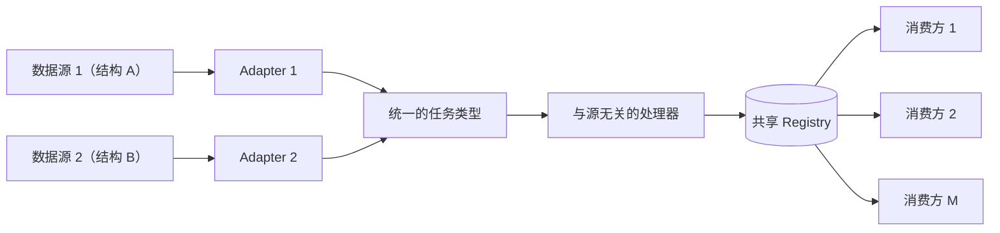
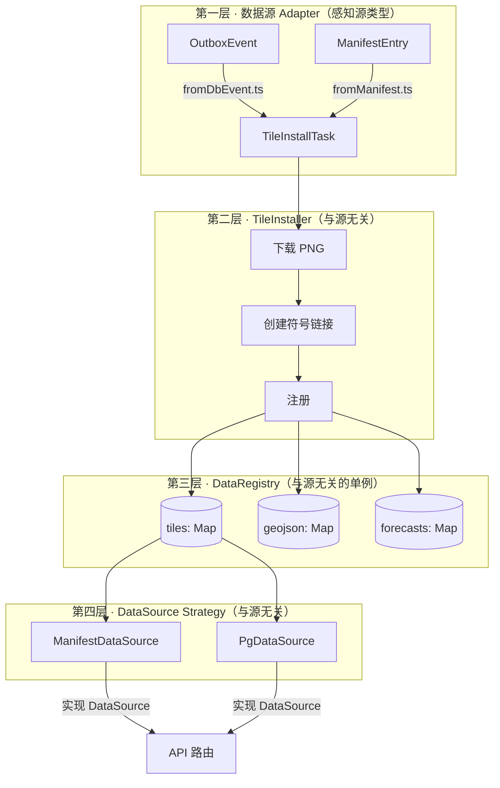

## 这其实是个通用问题

抛开瓦片和预报数据的具体场景，这个问题本身是通用的：M 个消费方调用点需要 N
种数据类型，而每种数据类型都可能由不止一个互相独立的上游源产出，且每个源的事件/负载
结构都不一样。如果不做抽象，最直接的修复方式是在每个调用点加一个 fallback
分支——暴露面是 **M × N × 源的数量**，而且每个分支还得知道该信哪个源、怎么处理部分失败。



修复方式是：把所有源特有的知识都收敛进一层薄薄的 adapter 边界，统一转换成一个共享的
中间类型，让所有消费方都只从一个与源无关的 registry 读取数据。加一个新源只需要加一个
adapter——从不触碰任何消费方。不管"源"是支付 webhook、多家鉴权 provider，还是消息
队列，这个骨架都成立——包括下面这个具体案例：一个 Postgres outbox 和一个 S3 manifest 流。

## 一个具体案例

这是这套骨架的一个具体实例：一个我维护的 Next.js 应用，渲染地理空间瓦片和时间序列
预报数据。这个应用从两个完全独立的数据源摄入瓦片图片、GeoJSON 聚类文件和预报用的
parquet 文件：

| 数据源           | 工作方式                                   | 事件结构                                    |
| ---------------- | ------------------------------------------- | -------------------------------------------- |
| **PG Outbox**    | PostgreSQL `LISTEN/NOTIFY` + 5 分钟一次的 cron 补漏 | 扁平化 `variables[]` 的 `OutboxEvent`         |
| **S3 Manifest**  | 基于 ETag 的 S3 轮询（30 秒一次）           | 嵌套 `tile_groups[]` 的 `ManifestEntry`       |

两个数据源最终做的是同一件事：从 S3 下载瓦片 PNG、为 web 提供服务创建符号链接、下载 GeoJSON 聚类文件，并把数据注册进系统好让 API 路由能找到它们。manifest 这条路径还会额外下载 Hive 分区的 parquet 文件供 DuckDB 查询使用。

这两个数据源同时存在是历史演进的结果。PG outbox 是最早的实时通知机制；S3 manifest 是后来加入的，作为一种更健壮、最终一致、且不依赖长连接数据库的替代方案。

## 问题

开始规划 manifest 集成时，最直接的做法是在每个 API 路由里写 try/catch 兜底：

```typescript
// 这个模式 × 5 个路由 × 3 种数据类型 = 灾难
try {
  data = await manifestSource.getTiles();
} catch {
  data = await pgSource.getTiles();
}
```

我有 5 个 API 路由、3 种数据类型（瓦片、GeoJSON、预报），这套 fallback 模式要在每一种组合里都出现一遍。更麻烦的是，每个路由还得知道**先试哪个源**、处理部分失败的情况，还要处理两个源都有数据、但来自不同模型运行批次的情况。

第二个问题更隐蔽。每个源都有自己一套追踪"本地有哪些数据可用"的方式：

- DB 事件写入一张 PostgreSQL 表 `location_images`
- manifest 更新写入一个 `LocalSyncState` JSON 文件

API 路由必须知道该查哪一个。如果以后再加第三个源，就得把每个路由再改一遍。

第三个问题出在下载逻辑本身。`downloadTilesFromEvent()` 和 `downloadFromManifestEntry()` 各自把自己源特有的类型拆解开，最后都调用同样的 `downloadTilesToStableDir()` + `createVariableSymlink()`。两条并行的代码路径做着完全相同的事，只是输入形状不一样。

## 设计原则

动手写代码之前，我先定下几条规则。这几条都不是瓦片或预报特有的——只要一个系统里
存在不止一个上游能产出同一个逻辑实体，这几条都成立：

**对数据源盲感（Source blindness）。** adapter 层之后的所有代码都必须与数据源无关。共享代码里不允许出现任何 `if (source === 'db')`。两个 adapter 文件是**唯一**知道事件结构长什么样的地方。

**Registry 即真相（Registry as truth）。** API 路由只从一个内存 registry 里读取数据。永远不直接查询 PG 表或 manifest 状态文件来判断"有什么数据可用"。

**幂等安装（Idempotent install）。** 两个数据源同时安装同一份数据必须是无操作（no-op）。不用锁，不需要分布式协调，去重逻辑完全由 registry 内部处理。

**启动时只认一个源（One source at startup）。** 根据配置，只注册一个 `DataSource` 实现。不做运行时切换，不做 fallback chain。信任哪个源，由运维人员静态决定。

## 架构

这套方案把四个通用角色组合成四层，每一层只负责一件事——一个 **Adapter** 边界、一个
与源无关的 **Orchestrator**、一个共享 **Registry**、一个 **Strategy** 接口：



### 第一层：Adapter

这是 **Adapter** 边界——唯一被允许知道某个源原生结构长什么样的地方。具体到这里，
每个 adapter 都是一个纯函数，把源特有的类型转换成共享的 `TileInstallTask`：

```typescript
// fromDbEvent.ts —— 唯一知道 OutboxEvent 长什么样的文件
export function toInstallTask(event: OutboxEvent): TileInstallTask {
  const payload = event.payload as TileUploadCompletedPayload;
  return {
    modelId: payload.ctx.model_id,
    rename: extractRename(payload.ctx.s3_path),
    dateHour: payload.ctx.date_hour,
    s3Path: payload.ctx.s3_path,
    groups: [{ variables: payload.ctx.variables, ... }],
    source: 'db-event',
  };
}
```

manifest 那边的 adapter 做的是同样的转换，只是源类型换成 `ManifestEntry`。到这一步之后，管线剩下的部分完全不知道、也不关心数据是从哪儿来的。

### 第二层：TileInstaller

这是与源无关的 **Orchestrator**——只用共享类型来编排真正的工作，完全不知道这个
任务来自哪个源。具体到这里，它接收一个 `TileInstallTask`，做四件事：

1. 把瓦片 PNG 从 S3 下载到一个稳定目录（按变量名做内容寻址，而不是按模型运行批次）
2. 在 `rdm/` 下创建一个随机化的符号链接供 web 服务使用（这样 URL 不会暴露内部目录结构）
3. 把瓦片元数据注册进 DataRegistry
4. 清理旧的预报时间目录

关键的设计决定是：**installer 不拥有下载逻辑本身。** 它把下载委托给已经存在的 `downloadTilesToStableDir()`。installer 只是一个协调者，负责把"下载 → 建符号链接 → 注册"这几步排好顺序，并管理符号链接的生命周期。

### 第三层：DataRegistry

这是共享的 **Registry**——所有消费方读取"当前有什么数据可用"的唯一地方，也是
多个源报告同一个逻辑实体时冲突消解逻辑所在的地方。具体到这里，它是挂在 `globalThis`
上的一个内存单例（这么做是必须的，因为 Next.js Turbopack 会在不同上下文里分别求值
模块——如果用模块级变量，API 路由和 instrumentation 代码里会各自持有一份重复的实例）。

有意思的部分是按源优先级去重。当两个源都启用时，同一个瓦片可能被注册两次——一次来自 DB 事件，一次来自 manifest。registry 负责消解这个冲突：

```typescript
private shouldAccept(existing: TileRecord | undefined, incoming: TileRecord): boolean {
  if (!existing) return true;
  if (incoming.dateHour > existing.dateHour) return true;  // 更新的数据优先
  if (incoming.dateHour === existing.dateHour) {
    return SOURCE_PRIORITY[incoming.source] >= SOURCE_PRIORITY[existing.source];
  }
  return false;
}
```

优先级顺序是：**manifest > db-event**。manifest 代表的是上游管线发布的一份完整、经过校验的快照；DB 事件是增量的实时通知，可能在文件还没完全上传完之前就先到了。当两者报告同一个 `dateHour` 时，以 manifest 记录为准。

实际生产中我们同一时间只启用一个源。但这套优先级逻辑保证了即使两个源被误开启，系统的行为依然是正确的。

### 第四层：DataSource Strategy

这是 **Strategy** 接口——消费方调用穿过的那道缝，启动时决定一次，之后再也不分支。
具体到这里，API 路由调用 `getGlobalDataSource()`，拿到的是启动时注册好的那个具体实现：

```typescript
// instrumentation.ts —— 进程启动时只跑一次
if (isManifestSyncEnabled()) {
  setGlobalDataSource(
    new ManifestDataSource(registry, forecastStore, tideStore),
  );
} else {
  setGlobalDataSource(new PgDataSource(registry));
}
```

`DataSource` 接口有六个方法——`getTileWebPrefix()`、`getAllTiles()`、`getGeojsonFiles()`、`getAddrAndGeojson()`、`getForecast()`、`getTide()`、`getStatus()`。每个实现都用自己的后端存储去满足这份契约：

- **ManifestDataSource** 从 registry 读瓦片/GeoJSON，从 DuckDB parquet 存储读预报/潮汐数据。
- **PgDataSource** 直接查询 PostgreSQL 拿数据，但健康状态/status 依然从共享 registry 读取（两个源都通过同一套 installer 管线写入 registry）。

API 路由和数据源完全解耦：

```typescript
// 任意 API 路由——完全不感知数据源
const ds = getGlobalDataSource();
const tiles = await ds.getAllTiles();
```

## 健康检查端点

有一个不太起眼但很重要的需求是运维可见性。`/api/health` 端点不能只显示"已加载 4 个瓦片"，还得显示每个变量具体在提供**哪一次**模型运行的数据：

```json
{
  "status": "ok",
  "datasource_status": {
    "tiles": 4,
    "tile_details": {
      "metric:a": "20260312_18",
      "metric:b": "20260312_18",
      "metric:c": "20260313_00",
      "metric:d": "20260313_00"
    },
    "geojson_date_hours": ["20260312_18", "20260312_12"],
    "forecast_details": {
      "region-a": ["20260312_18", "20260312_12"]
    }
  }
}
```

有了 registry 之后这就很直接了——只需要暴露 `getTileDetails()`、`getGeojsonDateHours()`、`getForecastDetails()` 这几个 getter。因为 `ManifestDataSource` 和 `PgDataSource` 读的是同一个 registry，无论当前激活哪个源，health 输出的结构都完全一致。

有一个坑：在 DB 模式下，补漏用的 cron 会按 dateHour 对事件分类——最新的 dateHour 总是会从 S3 重新下载，而较旧的事件只做本地重新注册，不下载。重新注册这条路径会扫描本地稳定目录、重建符号链接，并同时更新 registry 和 PG 的向后兼容表。这样一来，重启之后所有状态都能在每个事件毫秒级的时间内恢复一致。

## 符号链接的坑

瓦片服务架构里，`rdm/` 目录下的符号链接指向 `tiles/` 下的稳定目录。多个符号链接可能指向同一个稳定目录（不同的模型运行批次可能共享同一份瓦片数据）。这就造成了一个危险的清理场景：如果对一个符号链接目录执行 `rm -rf`，操作系统会跟随链接**把真实文件删掉**，连带弄坏所有引用这份数据的其他符号链接。

这几条安全规则最后重要到必须写成硬约束记录下来：

- 用 `fs.unlinkSync()` 删除符号链接（只删链接本身，不删目标）
- 用 `fs.rmdirSync()` 删除空目录（目录非空时会安全失败，不会误删）
- **永远不要**对 `rdm/` 下的任何东西用 `fs.rmSync({ recursive: true })`

清理函数用 `lstat()`（而不是 `stat()`）来检测符号链接、且不跟随链接，然后用 `unlink()` 只删除链接本身。

## 如果重来我会怎么做

**registry 重建。** manifest 模式下有一个 `rebuildRegistryFromState()`，冷启动时从持久化的 manifest 状态里重新填充 registry。DB 模式用的是补漏 cron 的重新注册路径——它会扫描本地文件，一次性重建符号链接 + registry + PG。这个方案能用（对旧事件来说亚秒级完成），但比起复用补漏循环，一个专门的重建函数会更干净。

**`localPath` 字段。** DB 模式下 `ForecastRecord.localPath` 是空的，因为预报数据存在 PostgreSQL 里，不在本地 parquet 文件里。这个记录的存在纯粹是为了状态追踪。更干净的设计应该把"有什么数据可用"（状态）和"数据在磁盘上哪个位置"（访问路径）拆成两个字段。

**优先级逻辑的测试覆盖。** 按源优先级去重这套逻辑经人工审查是正确的，但我没有一个同时跑两个源、校验 registry 最终状态的集成测试。生产环境里我们同一时间只开一个源，所以风险不高，但这确实是个缺口。

## 结果

重构之后：

- **5 个 API 路由**从依赖源判断变成了完全无感知源。每个路由都只是一句 `getGlobalDataSource().method()`。
- **2 条下载路径**合并成了 1 个共享的 `TileInstaller.install()`。
- **对数据源的感知**被严格限制在 2 个 adapter 文件（`fromDbEvent.ts`、`fromManifest.ts`）和 `instrumentation.ts` 里的启动接线代码。
- **新增第三个数据源**只需要：一个新的 adapter 文件、一个新的 `DataSource` 实现、`instrumentation.ts` 里加一个新分支。API 路由、registry、installer 全部零改动。

系统在生产环境里以 manifest 模式跑了两周。要切到 DB 模式测试，只需要改 `.env` 里两行——把 `MANIFEST_SYNC_ENABLED` 和 `DB_EVENT_CONSUMER_ENABLED` 翻转一下——不需要改任何代码。
