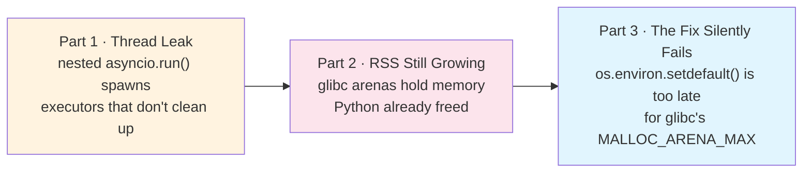
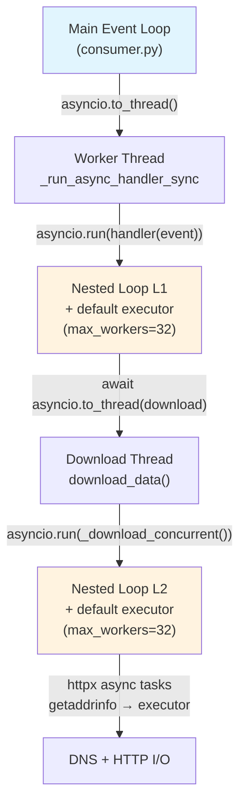
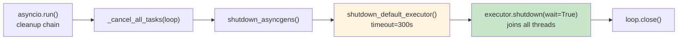
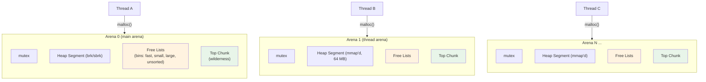
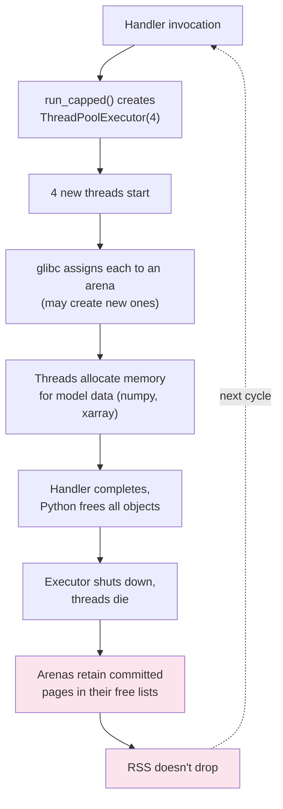
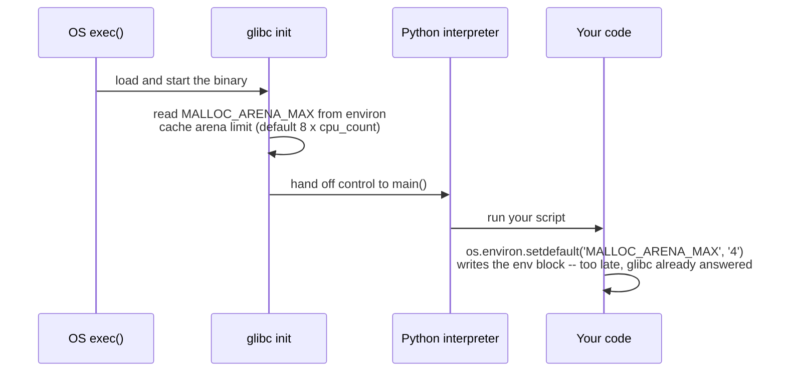

## TL;DR

A long-running Python 3.12 service leaked 32 OS threads every processing cycle, and even after
that got fixed, RSS kept climbing — while every Python-level profiler (`tracemalloc`,
`pympler`) reported a clean heap. The first bug was structural: nested `asyncio.run()` calls
each spin up a fresh default `ThreadPoolExecutor`, and fire-and-forget tasks race against that
executor's shutdown, so threads survive cleanup. The second bug was one layer below Python
entirely: glibc assigns each new thread to its own memory arena, and short-lived thread pools
leave those arenas — and the committed memory inside them — behind forever. The third bug was a
footgun in how you fix the second: `os.environ.setdefault('MALLOC_ARENA_MAX', ...)` silently
does nothing, because glibc reads that variable once, before the Python process even starts.
None of these three failure modes are specific to this service — they generalize to any
long-running process that spawns threads through nested event loops or executors.



## The Symptom

WavePy is a long-running Python 3.12 service that ingests large external datasets, runs a
numerical model, and produces map tiles on a fixed processing cycle. It runs 24/7, processing a
new data cycle every 6 hours.

After a recent refactor to an event-driven architecture, I noticed RSS growing steadily. Over 24 hours and 5 model run cycles, the process gained ~820 MB:

```text
Cycle 1 (00z):  RSS ~830 MB
Cycle 2 (06z):  RSS ~980 MB
Cycle 3 (12z):  RSS ~1150 MB
Cycle 4 (18z):  RSS ~1340 MB
Cycle 5 (00z):  RSS ~1650 MB
```

I added pympler's `SummaryTracker` and `tracemalloc` at handler entry/exit points. The Python heap looked clean — object counts were stable, no growing diffs. I audited every global dict and cache in the codebase (`data_sources`, `geocoding_cache`, `_boundary_ctx_state`, `_model_run_requested`). All were bounded — capped by data source count or had TTL eviction.

The Python-side memory was fine. Something else was eating RSS.

## From Memory to Threads

I checked `/proc/PID/status` directly:

```bash
$ grep -E 'VmRSS|Threads' /proc/3000119/status
VmRSS:    1653196 kB
Threads:  332
```

332 threads. The service has 3 poll routes with a concurrency limit of 2 per route — at most 6 handlers run simultaneously. 332 is far more than the architecture requires.

I broke down the thread types by reading `/proc/PID/task/TID/comm`:

```bash
$ for t in /proc/3000119/task/*/comm; do cat "$t"; done | sort | uniq -c | sort -rn
    316 python
     14 AwsEventLoop
      2 jemalloc_bg_thd
```

The 14 `AwsEventLoop` threads are from the AWS CRT SDK (boto3's underlying C library). The 2 jemalloc threads are the allocator's background GC. Both are expected.

316 Python threads. Their wait states showed what they were doing:

```bash
$ for t in /proc/3000119/task/*/wchan; do cat "$t"; done | sort | uniq -c | sort -rn
    314 futex_wait_queue
     17 ep_poll
      1 do_poll
```

314 threads in `futex_wait_queue` — idle in executor thread pools, waiting for work submissions. The process had been running for 21.5 hours. None of these threads had been cleaned up.

## Thread Timeline Forensics

Each thread's start time is recorded in `/proc/PID/task/TID/stat`, field 22 (`starttime` in clock ticks since boot). I extracted all 332 thread start times and converted them to seconds-from-process-start:

```bash
# Extract starttime (field 22) for each thread
for tid in $(ls /proc/3000119/task/); do
    st=$(awk '{print $22}' /proc/3000119/task/$tid/stat 2>/dev/null)
    echo "$tid $st"
done | sort -k2 -n > /tmp/thread_timeline.txt
```

Grouping by creation time:

```text
Batch  Threads  Time from start   What happened
────── ──────── ─────────────────  ──────────────────────────────
1-19   231      0–7.6s            Startup (bootstrap cascade)
22     32       +7951.6s (2h12m)  NoaaGfsDS download completes
23     32       +8091.8s (2h14m)  NoaaDS download completes
24     32       +72947.5s (20h)   Next cycle download completes
```

Every batch was exactly **32 threads**. That number is `min(32, os.cpu_count() + 4)` — Python's default `ThreadPoolExecutor` `max_workers` on this 28-CPU host.

Each batch appeared at exactly the moment a pipeline handler completed — a download finishing, a model run starting, a tile upload beginning. One full `ThreadPoolExecutor` pool, created and never destroyed, per handler invocation.

## The Architecture: Triple-Nested asyncio.run()

WavePy's event consumer dispatches async handlers into worker threads. The nesting looks like this:



The main event loop dispatches handlers via `asyncio.to_thread()`. The handler wrapper calls `asyncio.run()` to create a nested event loop (L1). Inside the handler, download functions call `asyncio.run()` again for a second nested loop (L2). Each `asyncio.run()` lazily creates its own default `ThreadPoolExecutor(max_workers=32)` the first time `asyncio.to_thread()` or `loop.run_in_executor(None, ...)` is called.

In theory, `asyncio.run()` cleans up properly:



`shutdown_default_executor` calls `executor.shutdown(wait=True)`, which should join all idle threads. In the CPython 3.12 source, it's explicit — a background thread calls `shutdown(wait=True)`, the main thread awaits its completion via a Future, with a 300-second timeout.

But all 332 threads were still alive.

## Reproducers Don't Leak

I wrote three reproducers matching the exact nesting architecture:

```python
# Simplified: triple-nested asyncio.run() like WavePy
async def handler():
    result = await asyncio.to_thread(blocking_download)
    return result

def blocking_download():
    return asyncio.run(async_download_concurrent())

async def async_download_concurrent():
    async with httpx.AsyncClient() as client:
        tasks = [client.get(url) for url in urls]
        return await asyncio.gather(*tasks)

# Dispatch like consumer does
def run_handler_sync(handler_fn, event):
    return asyncio.run(handler_fn(event))

await asyncio.to_thread(run_handler_sync, handler, event)
```

None leaked. After each `asyncio.run()` returned, thread count dropped back to baseline. The architecture itself cleans up just fine.

Something specific to WavePy's real code path was preventing cleanup.

## The Fire-and-Forget Pattern

The actual handler code for tile upload completion had this pattern:

```python
# event_handlers.py — _process_tile_upload_request_event
async def _process_tile_upload_request_event(event):
    # ... tile upload logic ...

    # "Fire-and-forget" cleanup
    asyncio.create_task(
        asyncio.to_thread(_cleanup_outdated_s3_dirs, model_id, s3_path, date_hour)
    )
    asyncio.create_task(
        asyncio.to_thread(_create_s3_finish_flag, model_id, s3_path, date_hour)
    )
    asyncio.create_task(_async_cleanup_dir(cleanup_target))

    return True  # handler returns immediately
```

Here's what happens:

1. `asyncio.create_task(asyncio.to_thread(...))` submits work to the event loop's default executor
2. The handler returns `True`
3. `asyncio.run()` begins cleanup: `_cancel_all_tasks(loop)` cancels the orphaned tasks
4. But cancelling a `Task` wrapping `to_thread()` doesn't cancel the underlying executor submission — the sync functions are already running (or queued) in the `ThreadPoolExecutor`
5. `shutdown_default_executor()` calls `executor.shutdown(wait=True)`, which waits for the running work items to finish
6. If those S3 cleanup operations take long enough, or if there's a timing issue with the shutdown sequence, threads persist

Combined with the fact that every handler invocation creates a *fresh* `asyncio.run()` with a *fresh* default executor capable of spawning 32 threads, and cleanup may not fully join them, the leak compounds on every cycle.

## A Third Uncapped `asyncio.run()`, Hidden Behind Dead Code

`noaa.py`'s download functions are a third call site that invokes `asyncio.run()` — worth
checking for the same unbounded-executor problem as the other two. The code had this pattern in
two places:

```python
# noaa.py — download_data() and download_file()
try:
    loop = asyncio.get_event_loop()
    if loop.is_closed():
        loop = asyncio.new_event_loop()
        asyncio.set_event_loop(loop)
    result = loop.run_until_complete(coro)
except RuntimeError:
    result = asyncio.run(coro)
```

In Python 3.12, `asyncio.get_event_loop()` raises `RuntimeError` when called from a thread that has no running event loop and no loop set via `set_event_loop()`. Since these download functions always run inside `asyncio.to_thread()` worker threads, the `try` block always fails, and the `except RuntimeError` path always runs. The top half is dead code — it never executes.

That dead code wasn't just harmless clutter: it obscured the fact that the live branch, `asyncio.run(coro)`, ran unconditionally on *every* call — creating a fresh, uncapped default executor each time, the same problem as the other two call sites.

## OpenBLAS Thread Pool

During the thread timeline analysis, 25 threads appeared in the first milliseconds of startup — before any handler ran. These come from OpenBLAS, which spawns one thread per CPU core on `import numpy`.

I searched the entire WavePy codebase for BLAS-routed operations:

```bash
$ grep -rn 'np\.dot\|np\.matmul\|np\.linalg\|scipy\.linalg\|np\.fft' src/
# (no matches)
```

No matches. WavePy uses `scipy.interpolate.griddata` (Delaunay triangulation, not BLAS), `RegularGridInterpolator` (index lookup + linear weighting, not BLAS), and element-wise numpy ops (`np.where`, `np.isnan`, `np.meshgrid`). All 25 OpenBLAS threads were idle for the lifetime of the process.

## The Fixes

Four changes:

### 1. run_capped(): Cap the Executor

The core fix. A drop-in replacement for `asyncio.run()` that pre-sets a small executor:

```python
# src/wavepy/utils/thread_monitor.py

def run_capped(coro):
    """asyncio.run() replacement with a capped default executor."""
    with asyncio.Runner() as runner:
        loop = runner.get_loop()
        loop.set_default_executor(
            ThreadPoolExecutor(max_workers=4, thread_name_prefix="capped")
        )
        return runner.run(coro)
```

`asyncio.Runner` (Python 3.11+) exposes the event loop before running the coroutine. By calling `loop.set_default_executor()` with a 4-worker pool, any `asyncio.to_thread()` or `run_in_executor(None, ...)` inside the handler is constrained. Even if cleanup is imperfect, the damage is 4 threads instead of 32.

The `Runner` context manager handles the full shutdown sequence on `__exit__` — cancel tasks, shutdown asyncgens, shutdown executor, close loop.

Applied to `consumer._run_async_handler_sync`, `noaa.download_data`, `noaa.download_file`, and the bootstrap cascade in `event_handlers.py`.

### 2. Await Fire-and-Forget Tasks

```python
# Before: orphaned tasks, leaked executor threads
asyncio.create_task(asyncio.to_thread(_cleanup_outdated_s3_dirs, ...))
asyncio.create_task(asyncio.to_thread(_create_s3_finish_flag, ...))
return True

# After: properly await cleanup before returning
cleanup_tasks = [
    asyncio.to_thread(_cleanup_outdated_s3_dirs, model_id, s3_path, date_hour),
    asyncio.to_thread(_create_s3_finish_flag, model_id, s3_path, date_hour),
]
if local_tile_dir:
    cleanup_tasks.append(_async_cleanup_dir(cleanup_target))

results = await asyncio.gather(*cleanup_tasks, return_exceptions=True)
for r in results:
    if isinstance(r, Exception):
        logger.warning('Post-upload cleanup error: %s', r)
return True
```

The cleanup operations (S3 directory pruning, finish flag creation, local dir removal) are fast — seconds at most. Awaiting them ensures no orphaned tasks when `asyncio.run()` does its shutdown.

### 3. Cap the Executor in noaa.py (and Delete the Dead Code Hiding It)

Replaced the try/except `get_event_loop` pattern with a direct `run_capped()` call — the same
fix as #1, applied to the call site the dead code had been masking:

```python
# Before (19 lines of dead code + live code)
try:
    loop = asyncio.get_event_loop()
    if loop.is_closed():
        loop = asyncio.new_event_loop()
        asyncio.set_event_loop(loop)
    succeeded, failed, expired = loop.run_until_complete(
        self._download_cycle_concurrent(...)
    )
except RuntimeError:
    succeeded, failed, expired = asyncio.run(
        self._download_cycle_concurrent(...)
    )

# After (3 lines)
succeeded, failed, expired = run_capped(
    self._download_cycle_concurrent(
        cycle_date, cycle_hour, forecast_hours, variables, zarr_store_path
    )
)
```

### 4. Suppress OpenBLAS Thread Pool

Added to the top of `wavepy.py`, before any import that touches numpy:

```python
import os
os.environ.setdefault('OPENBLAS_NUM_THREADS', '1')
```

Since no BLAS-routed operation exists in the codebase, this has zero performance impact and eliminates 24 idle C threads.

## Instrumentation

To verify the fixes, I added lightweight thread monitoring that reads `/proc/self/task` at `asyncio.run()` boundaries:

```python
def log_thread_count(label: str, detail: str = "") -> None:
    count = len(os.listdir("/proc/self/task"))
    logger.info("[THR] %s (%s): %d OS threads", label, detail, count)
```

Called at handler entry/exit in `_run_async_handler_sync`.

## Verification

Killed the old process (332 threads, 21.5 hours uptime), restarted with the fixes:

```text
[THR] nested_loop_enter (data.download.requested): 204 OS threads
[THR] nested_loop_enter (data.download.requested): 206 OS threads
[THR] nested_loop_exit  (data.download.requested): 210 OS threads
[THR] nested_loop_enter (boundary.requested):      210 OS threads
[THR] nested_loop_exit  (boundary.requested):      242 OS threads
[THR] nested_loop_enter (boundary.completed):      242 OS threads
[THR] nested_loop_enter (tile.upload.requested):   331 OS threads  ← peak during model run
[THR] nested_loop_exit  (boundary.completed):      275 OS threads  ← cleanup working
[THR] nested_loop_exit  (tile.upload.requested):   279 OS threads
[THR] nested_loop_exit  (data.download.requested): 275 OS threads
[THR] nested_loop_exit  (tile.upload.requested):   272 OS threads
```

Thread count after full pipeline cycle, idle for 90+ seconds: **273**. Down from **332**.

```text
Before:  332 threads, growing +32 per handler cycle, zero cleanup
After:   273 threads, stable after first cycle, cleanup visible at each nested_loop_exit
```

The 204 → 273 growth during the first cycle (+69) comes from the main event loop's default executor, which I haven't capped yet (max_workers=32, shared across all route dispatches). That's the next optimization — setting `loop.set_default_executor(ThreadPoolExecutor(max_workers=8))` on the consumer's main loop. With 3 routes × 2 concurrency = 6 max concurrent handlers, 8 workers is sufficient.

The important signal is that thread count no longer grows on subsequent cycles. Each `nested_loop_exit` shows the capped executor being properly cleaned up — the count drops or stays flat, rather than accumulating +32 per invocation.

## Why the Reproducers Didn't Leak

In hindsight, the reproducers completed their fire-and-forget tasks within milliseconds (simple `time.sleep(0.1)` stubs). The real handlers submitted S3 operations that take seconds. The timing window between "executor work submitted" and "shutdown_default_executor called" is what determines whether threads get joined. Short-lived stubs always finish before shutdown; real I/O sometimes doesn't.

The `run_capped()` approach sidesteps the root cause entirely — even if some threads survive shutdown, 4 per handler is manageable. And properly awaiting the cleanup tasks eliminates the fire-and-forget timing problem altogether.

## Thread Budget

After the fixes, the steady-state thread breakdown:

```text
257  python (main + executor pools + handler threads)
 14  AwsEventLoop* (AWS CRT SDK — fixed, expected)
  2  jemalloc_bg_thd (allocator — fixed, expected)
───
273  total

Wait states:
255  futex_wait_queue (idle pool threads)
 17  ep_poll (event loops: 1 main + 14 AWS CRT + 2 notification/misc)
  1  do_wait (main thread)
```

Still higher than I'd like. The 255 idle pool threads include the main loop's uncapped 32-thread executor plus thread pools from libraries (httpx, boto3). Capping the main loop executor is the obvious next step.

## Part 2: Threads Fixed, RSS Still Growing

With the thread leak fixed, I set up a background monitor that polls `/proc/self/task` (thread count) and `VmRSS` every 5 minutes, then left the process running through two consecutive data cycles (00z and 06z). Thread count held at 304 through both cycles. RSS did not:

```text
Time            Threads  RSS      Event
──────────────  ───────  ───────  ──────────────────────────
23:28 (idle)    304      766 MB   Cycle 1 completed, idle
23:33–01:08     304      766 MB   Idle for 2 hours — flat
01:10           304      766 MB   Cycle 2 starts (06z)
01:13           282      998 MB   Download + extraction
01:28           304      1675 MB  Model run peak
01:38           304      1634 MB  Declining
01:43           304      1523 MB  Declining
01:50           304      966 MB   Cycle 2 complete
01:53           304      966 MB   Idle — 200 MB higher
```

Thread count held at 304. RSS went from 766 MB post-Cycle 1 to 966 MB post-Cycle 2 — a 200 MB residual per cycle.

The 2-hour idle period between cycles (rows 2–21 in the monitor log) was informative: RSS was flat at 766 MB the entire time. If Python objects were leaking — growing dicts, unreleased xarray datasets — RSS would drift during idle. It didn't. The 200 MB appeared during the model run and persisted after Python had freed all objects associated with the cycle.

## /proc/smaps: Where the Memory Actually Lives

`/proc/PID/smaps` provides per-mapping memory statistics — virtual size, RSS, shared/private breakdown — for every memory region in the process. By filtering for anonymous `rw-p` regions (read-write, private, no file backing), I could classify where the 935 MB of RSS was actually allocated:

```python
entries = []
with open('/proc/3597344/smaps') as f:
    # parse each region: start addr, end addr, RSS
    ...

# Main heap vs everything else
heap_rss = sum(e['rss'] for e in entries if '[heap]' in e['name'])
anon_rss = sum(e['rss'] for e in anon_entries)
```

The result:

```text
Python main heap ([heap]):    68 MB
glibc arenas (164 regions):  548 MB   ← here's the bloat
Other anonymous mmap:        319 MB
────────────────────────────────────
Total anonymous RSS:         935 MB
```

68 MB in the Python heap (the `[heap]` region grown via `brk()`). 935 MB total anonymous RSS. The remaining 867 MB was in regions allocated by glibc's malloc — specifically, its per-thread arenas.

A note on CPython's memory architecture: CPython has its own small-object allocator (`pymalloc`) that manages allocations ≤512 bytes in 256 KB pools. These pools are themselves allocated from glibc via `malloc`. Larger objects go directly through glibc. Either way, glibc is the bottom layer, and its arena behavior determines what the OS sees as RSS.

## glibc Arenas: The Invisible Memory Pool

The 867 MB gap between Python heap size and actual RSS comes from how glibc's malloc manages memory in multi-threaded programs.

### The Single-Lock Problem

Early `malloc` implementations had one global heap protected by one mutex. Any thread calling `malloc` or `free` had to acquire that lock. In a program with 304 threads, that's a serialization bottleneck — even threads allocating into completely independent regions of memory contend on the same lock.

glibc's ptmalloc2 (the allocator used on most Linux systems) solves this with *arenas*: multiple independent heaps, each with its own mutex.

### Arena Anatomy



Each arena contains:

- **Mutex** — one lock per arena; threads assigned to different arenas never contend
- **Heap segments** — the main arena grows via `brk()`; thread arenas get 64 MB chunks via `mmap()` and sub-allocate from there
- **Free lists (bins)** — when you call `free(ptr)`, the chunk goes into a bin sorted by size (fastbin for ≤160 bytes, smallbin, largebin, unsorted). These chunks are *available for reuse* but the **pages stay committed** in RSS
- **Top chunk** — the frontier of the heap. `malloc_trim()` can only shrink the top chunk back to the OS; anything below a live allocation is trapped

### Thread-to-Arena Assignment

When a thread first calls `malloc`:
1. glibc tries to find an arena with an unlocked mutex
2. If all existing arenas are locked, and the count is below `MALLOC_ARENA_MAX` (default: `8 × cpu_count`), a new arena is created via `mmap(64 MB)`
3. The thread remembers its assigned arena in a thread-local variable — subsequent `malloc`/`free` calls go to the same arena without scanning

This means: **thread creation drives arena creation**. Short-lived threads (like those in a `ThreadPoolExecutor` that gets shutdown) permanently create arenas that outlive them.

### Why free() Doesn't Return Memory

When Python calls `free()` (e.g., when a numpy array's refcount hits zero), glibc puts the chunk on the arena's free list. The virtual pages stay mapped and their RSS stays committed. The only ways memory goes back to the OS are:

1. **`malloc_trim()`** — shrinks the top chunk of each arena. Only works if the top chunk is free; a single small live allocation at the top pins everything below it
2. **`mmap`/`munmap` threshold** — allocations larger than 128 KB (by default) bypass arenas entirely and get their own `mmap`, which is `munmap`'d on `free`. This is why the 1675 MB peak during model run dropped to 966 MB — the large numpy arrays were `mmap`'d and returned. But thousands of smaller allocations (Python objects, dict entries, string buffers) went through arenas and stayed
3. **Arena destruction** — never happens in glibc. Once created, an arena lives until the process exits

### The Numbers

The default maximum arena count is `8 × cpu_count`. On my 28-CPU host: **224 arenas**.

I counted arena-aligned memory regions (glibc arenas start at 8MB-aligned addresses in the high memory range):

```text
Arena-aligned regions: 164, RSS = 548 MB
  >1 MB RSS: 107 arenas, total 544 MB
  <1 MB RSS:  57 arenas, total   3 MB
```

164 active arenas, 107 of them holding over 1 MB each. The top arena alone had 52 MB resident.

## Why So Many Arenas?

Every call to `run_capped()` creates a new `ThreadPoolExecutor(max_workers=4)`, which spawns up to 4 new threads. When those threads call `malloc`, glibc assigns each to an arena — often a new one, since there's room for 224. When the executor shuts down and its threads die, the arena stays. Its free list holds committed pages that were allocated during the model run (numpy arrays, xarray datasets, GRIB buffers), freed by Python, but never returned to the OS.

On the next cycle, a new `run_capped()` call creates another executor with another set of threads, which may get assigned to yet more arenas.

The sequence per handler invocation, repeating every cycle:



## The Fix: Two Lines

### 1. Cap Arena Count

```python
# wavepy.py — before any import
os.environ.setdefault('MALLOC_ARENA_MAX', '4')
```

(This `os.environ.setdefault` turns out to be too late for glibc — it reads the variable once at process startup, before Python runs. See Part 3 for why, and the correct approach.)

Why 4: `run_capped()` uses `max_workers=4`, meaning at most 4 threads allocate concurrently per handler. 4 arenas gives each thread its own arena — zero lock contention — while being 40× fewer than the 164 we observed. PostgreSQL uses 2; Python long-running services typically use 2–4. The key is the order-of-magnitude reduction from 164, not the exact number.

With 4 arenas, new threads reuse existing arenas instead of creating fresh ones. Freed memory in an arena gets reused by the next thread assigned to it.

### 2. Trim After Each Batch

Even with capped arenas, freed memory sits in free lists until someone asks for it back. `malloc_trim(0)` walks all arenas and releases top-of-heap free chunks via `munmap`:

```python
# src/wavepy/utils/thread_monitor.py

def trim_malloc() -> None:
    """Ask glibc to return free arena pages to the OS."""
    rss_before = _get_rss_mb()
    try:
        libc = ctypes.CDLL(ctypes.util.find_library("c"), use_errno=True)
        libc.malloc_trim(ctypes.c_int(0))
    except (OSError, AttributeError):
        return  # non-glibc platform
    rss_after = _get_rss_mb()
    freed = rss_before - rss_after
    if freed > 0:
        logger.info("[MEM] malloc_trim freed %d MB (RSS %d -> %d MB)",
                    freed, rss_before, rss_after)
```

Called after each batch of events completes in the consumer's poll loop:

```python
# consumer.py — _poll_route()
if tasks:
    await asyncio.gather(*tasks, return_exceptions=True)
    await asyncio.to_thread(trim_malloc)
```

This runs only when there were events to process — idle polls skip it.

## Why Not Just malloc_trim Without MALLOC_ARENA_MAX?

`malloc_trim` can only release *top-of-heap* free chunks in each arena. If a small allocation sits at the top of the arena's heap, everything below it stays committed — even if it's all free. With 164 arenas, the probability of at least some arenas having a "pinned top" is high.

`MALLOC_ARENA_MAX=4` reduces the number of arenas to manage, concentrates allocations, and makes `malloc_trim` far more effective. They're complementary.

## The Full Memory Picture

```text
Layer         What                           RSS impact    Fix
────────────  ─────────────────────────────  ────────────  ──────────────
Python heap   Objects, dicts, caches         68 MB         Already bounded
Thread stacks 304 threads × 8 MB default     ~150 MB*      run_capped() (Part 1)
glibc arenas  164 arenas × free lists        548 MB        MALLOC_ARENA_MAX=4
OpenBLAS      25 idle C threads              ~12 MB        OPENBLAS_NUM_THREADS=1
AWS CRT       14 event loop threads          ~8 MB         Expected, leave alone

* Thread stacks are virtual (8 MB each) but only RSS the touched pages.
  Actual RSS is much less than 304 × 8 MB.
```

The Python heap — where `tracemalloc` and `pympler` measure — was 68 MB throughout. The 548 MB in glibc arenas and 319 MB in other anonymous mappings are below the layer that Python memory profilers can observe. Diagnosing this required reading `/proc/smaps` directly.

## Part 3: When os.environ Is Too Late

After deploying all the fixes and restarting the process, I monitored it through a full pipeline cycle. `malloc_trim` was working — single calls freed up to 339 MB:

```text
[MEM] malloc_trim freed 242 MB (RSS 974 -> 732 MB)
[MEM] malloc_trim freed 339 MB (RSS 1070 -> 731 MB)
[MEM] malloc_trim freed 159 MB (RSS 1082 -> 923 MB)
```

But the overall RSS profile was wrong. Idle baseline sat at 755 MB. During model runs, RSS bounced between 730 and 1340 MB. If `MALLOC_ARENA_MAX=4` was in effect, arenas should be reusing memory instead of spreading across hundreds of independent free lists.

I checked `/proc/PID/environ`:

```bash
$ cat /proc/13983/environ | tr '\0' '\n' | grep MALLOC_ARENA_MAX
# (nothing)
```

Not there. Counted arena-proxy mappings in `/proc/PID/smaps`:

```text
Anonymous rw mappings: 598
```

598 anonymous mappings — more than the 164 from the previous run. `MALLOC_ARENA_MAX=4` had never taken effect.

### glibc Reads the Environment Once



`MALLOC_ARENA_MAX` is not a runtime tunable. glibc reads it during `libc` initialization, which runs before the dynamic linker transfers control to `main()` — before the Python interpreter even starts. By the time Python executes `os.environ.setdefault('MALLOC_ARENA_MAX', '4')`, glibc has already computed its arena limit as `8 × cpu_count = 224` and cached it internally. It never re-reads the environment.

`os.environ.setdefault()` does write to the process environment block. A subsequent `getenv("MALLOC_ARENA_MAX")` from C would return `"4"`. But glibc already has its answer.

This is why `OPENBLAS_NUM_THREADS` worked from the same `os.environ.setdefault()` call: OpenBLAS reads its thread count lazily, on the first BLAS call. The `setdefault` runs before any numpy import, so OpenBLAS sees it. Two libraries, same Python API call, different initialization timing — one works, one doesn't.

### Setting the Environment Before the Process

The variable must exist in the process environment before the binary starts. I moved it to the pixi task definition in `pyproject.toml`:

```toml
[tool.pixi.tasks]
start = { cmd = "wavepy", env = { MALLOC_ARENA_MAX = "4", OPENBLAS_NUM_THREADS = "1" } }
```

Pixi injects these into the environment before spawning the Python interpreter. glibc sees `MALLOC_ARENA_MAX=4` at initialization time.

The same applies to any process manager — systemd, Docker, supervisord. The env var must be set at the process level, not inside the application.

### The Actual Results

After restarting with the corrected environment:

```bash
$ cat /proc/42908/environ | tr '\0' '\n' | grep MALLOC_ARENA_MAX
MALLOC_ARENA_MAX=4
```

Comparing the metrics with `MALLOC_ARENA_MAX` actually in effect vs silently absent:

```text
                           Before (no cap)    After (cap=4)
                           ───────────────    ─────────────
Idle RSS:                  755 MB             351 MB          (−54%)
Anonymous RSS:             867 MB             259 MB          (−70%)
Large arena mappings:      107                50
malloc_trim per call:      up to 339 MB       2 MB
```

With 4 arenas, freed memory concentrates into reusable space. `malloc_trim` reclaims 2 MB per call instead of hundreds — not because it's less effective, but because there's less fragmentation to clean up.

Over 17 hours and 3 complete pipeline cycles, the idle baseline stabilized:

```text
Time          RSS       Δ previous cycle
───────────   ────────  ────────────────
Post-boot     384 MB    —
Post-Cycle 1  509 MB    +125 (arena warm-up)
Post-Cycle 2  514 MB    +5
Post-Cycle 3  532 MB    +18
```

Per-cycle growth dropped from +200 MB (unbounded) to +5–18 MB (converging). The initial +125 MB is a one-time cost as the 4 arenas fill their working sets. After that, freed memory gets reused in place instead of spilling into new arenas.

## Takeaways

- **A nested `asyncio.run()` is a nested executor factory.** Every `asyncio.run()` lazily
  creates its own default `ThreadPoolExecutor` the first time something calls
  `asyncio.to_thread()` or `run_in_executor(None, ...)`. Nest the calls and you nest the
  executors — and each one defaults to `min(32, cpu_count() + 4)` workers. Don't trust the
  default; pin the executor size explicitly with `asyncio.Runner` +
  `loop.set_default_executor()`.
- **Fire-and-forget tasks race the shutdown sequence, and usually lose.** Cancelling a `Task`
  that wraps `asyncio.to_thread()` doesn't cancel the underlying executor submission — if the
  work is already running, `shutdown(wait=True)` blocks on it, and short-lived reproducers won't
  reveal the bug because their stub work finishes before shutdown ever gets called. Await what
  you fire.
- **Python-level profilers are blind to threads and to the allocator below Python.**
  `tracemalloc` and `pympler` only see Python objects. Thread counts live in `/proc/PID/status`
  and `/proc/PID/task/*/{comm,wchan,stat}`; the memory a Python profiler can't explain usually
  lives in `/proc/PID/smaps`, one layer below the interpreter.
- **Thread churn drives arena churn, and arenas don't die.** glibc assigns each new thread to a
  memory arena on first `malloc()`. A short-lived `ThreadPoolExecutor` that gets created and
  destroyed every cycle leaves its arenas behind — with whatever memory was committed into them
  — because glibc never destroys an arena once created. Cap the arena count and `malloc_trim()`
  needs both: fewer arenas concentrates what's freeable, and trimming actually returns it.
- **Not every `os.environ.setdefault()` call works the same way.** Some libraries read their
  tunables lazily, on first use — `os.environ.setdefault()` from anywhere before that first use
  is enough. Others, like glibc's `MALLOC_ARENA_MAX`, are read once during C runtime
  initialization, before your language runtime even starts; setting them from inside the
  running process is silently a no-op. The fix has to happen at the process-launch layer — the
  task runner's env block, a systemd unit, a Dockerfile `ENV` — not inside `main()`.
