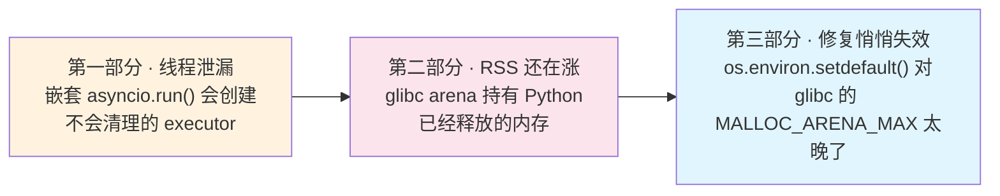
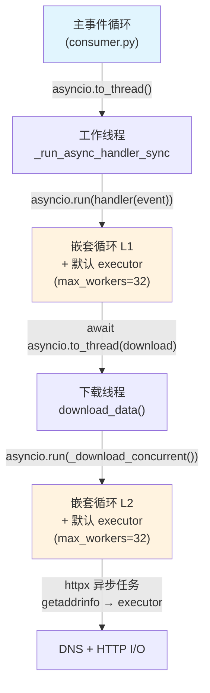
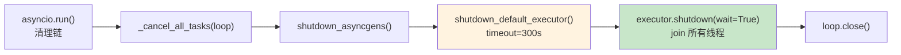
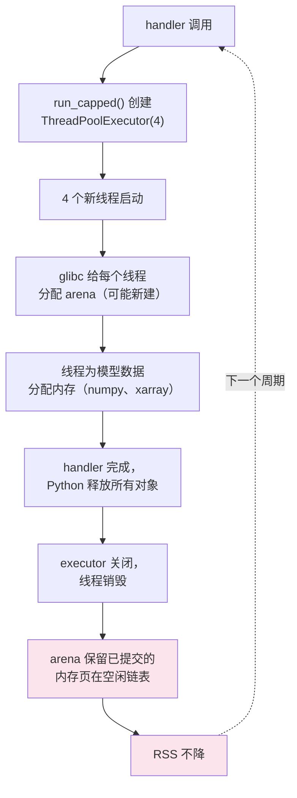
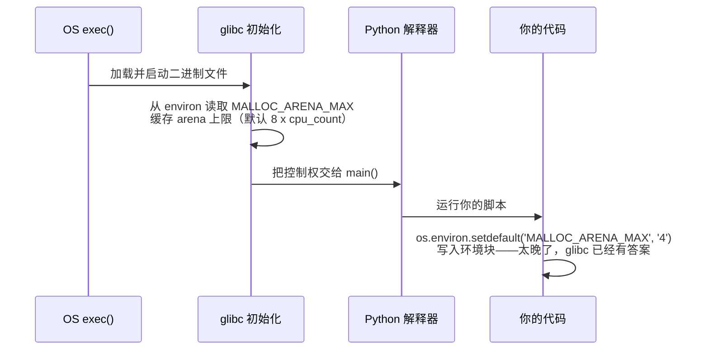

## 先说结论

一个长时间运行的 Python 3.12 服务每个处理周期泄漏 32 个 OS 线程；这个问题修好之后，
RSS 还在继续涨——而所有 Python 层的 profiler（`tracemalloc`、`pympler`）都报告堆很干净。
第一个 bug 是结构性的：嵌套的 `asyncio.run()` 调用每次都会新建一个默认
`ThreadPoolExecutor`，而 fire-and-forget 任务会和这个 executor 的 shutdown 抢时间，
导致线程逃过清理。第二个 bug 完全在 Python 之下的另一层：glibc 给每个新线程分配一个
独立的内存 arena，生命周期很短的线程池被销毁后，这些 arena——以及里面已提交的
内存——永远留了下来。第三个 bug 是修复第二个 bug 时的一个陷阱：
`os.environ.setdefault('MALLOC_ARENA_MAX', ...)` 悄悄地什么都没做，因为 glibc 只在
Python 进程启动之前读一次这个变量。这三类失败模式都不是这个服务特有的——只要是
通过嵌套事件循环或 executor 派生线程的长驻进程，都可能踩中同样的坑。



## 症状

WavePy 是一个 7×24 运行的 Python 3.12 服务，负责摄入大型外部数据集、跑一个数值模型、
按固定周期生成地图瓦片。每 6 小时处理一个新的数据周期。

最近重构为事件驱动架构后，我注意到 RSS 在持续增长。24 小时内经历 5 次模型运行，进程吃掉了约 820 MB 内存：

```text
Cycle 1 (00z):  RSS ~830 MB
Cycle 2 (06z):  RSS ~980 MB
Cycle 3 (12z):  RSS ~1150 MB
Cycle 4 (18z):  RSS ~1340 MB
Cycle 5 (00z):  RSS ~1650 MB
```

我在 handler 的入口和出口加了 pympler 的 `SummaryTracker` 和 `tracemalloc`。Python 堆没问题——对象数量稳定，diff 没有增长趋势。逐个审计了代码里的全局字典和缓存（`data_sources`、`geocoding_cache`、`_boundary_ctx_state`、`_model_run_requested`），全部有上界——要么受数据源数量约束，要么有 TTL 淘汰机制。

Python 层面的内存没有泄漏。别的东西在吃 RSS。

## 从内存到线程

直接看 `/proc/PID/status`：

```bash
$ grep -E 'VmRSS|Threads' /proc/3000119/status
VmRSS:    1653196 kB
Threads:  332
```

332 个线程。服务只有 3 条 poll 路由、每条并发上限 2——最多 6 个 handler 同时运行。332 远超架构需要的数量。

按 `/proc/PID/task/TID/comm` 分类：

```bash
$ for t in /proc/3000119/task/*/comm; do cat "$t"; done | sort | uniq -c | sort -rn
    316 python
     14 AwsEventLoop
      2 jemalloc_bg_thd
```

14 个 `AwsEventLoop` 是 AWS CRT SDK（boto3 底层 C 库）的线程，2 个 jemalloc 是分配器的后台 GC 线程，都在预期内。

316 个 Python 线程。看等待状态：

```bash
$ for t in /proc/3000119/task/*/wchan; do cat "$t"; done | sort | uniq -c | sort -rn
    314 futex_wait_queue
     17 ep_poll
      1 do_poll
```

314 个线程在 `futex_wait_queue`——空闲在 executor 线程池中，等待工作提交。进程已经跑了 21.5 小时，这些线程没有一个被回收。

## 线程时间线取证

每个线程的启动时间记录在 `/proc/PID/task/TID/stat` 的第 22 个字段（`starttime`，单位是系统启动以来的时钟 tick）。我提取了全部 332 个线程的启动时间，换算成相对进程启动的秒数：

```bash
for tid in $(ls /proc/3000119/task/); do
    st=$(awk '{print $22}' /proc/3000119/task/$tid/stat 2>/dev/null)
    echo "$tid $st"
done | sort -k2 -n > /tmp/thread_timeline.txt
```

按创建时间分组：

```text
批次   线程数   距启动时间         对应事件
────── ──────── ─────────────────  ──────────────────────────────
1-19   231      0–7.6s            启动（bootstrap cascade）
22     32       +7951.6s (2h12m)  NoaaGfsDS 下载完成
23     32       +8091.8s (2h14m)  NoaaDS 下载完成
24     32       +72947.5s (20h)   下一个周期下载完成
```

每个批次恰好是 **32 个线程**。这个数字是 `min(32, os.cpu_count() + 4)`——Python 的 `ThreadPoolExecutor` 在这台 28 核机器上的默认 `max_workers`。

每个批次出现的时刻恰好对应一个 pipeline handler 完成的时间——下载结束、模型启动、瓦片上传开始。每次 handler 调用创建一个完整的 32 线程池，然后再也不销毁。

## 架构：三层嵌套 asyncio.run()

WavePy 的事件 consumer 把异步 handler 分派到工作线程执行，嵌套关系如下：



主事件循环通过 `asyncio.to_thread()` 分派 handler。handler 封装函数调用 `asyncio.run()` 创建嵌套事件循环（L1）。handler 内部的下载函数再次调用 `asyncio.run()` 创建第二层嵌套循环（L2）。每个 `asyncio.run()` 在首次调用 `asyncio.to_thread()` 或 `run_in_executor(None, ...)` 时惰性创建一个 `ThreadPoolExecutor(max_workers=32)`。

理论上 `asyncio.run()` 会正确清理：



`shutdown_default_executor` 会调用 `executor.shutdown(wait=True)` 来 join 所有空闲线程。在 CPython 3.12 源码里写得很明确——一个后台线程执行 `shutdown(wait=True)`，主线程通过 Future 等待完成，超时 300 秒。

但 332 个线程全都还在。

## Reproducer 不泄漏

我写了三个 reproducer，完全复制了同样的嵌套架构：

```python
# 简化版：模拟 WavePy 的三层嵌套 asyncio.run()
async def handler():
    result = await asyncio.to_thread(blocking_download)
    return result

def blocking_download():
    return asyncio.run(async_download_concurrent())

async def async_download_concurrent():
    async with httpx.AsyncClient() as client:
        tasks = [client.get(url) for url in urls]
        return await asyncio.gather(*tasks)

# 像 consumer 一样分派
def run_handler_sync(handler_fn, event):
    return asyncio.run(handler_fn(event))

await asyncio.to_thread(run_handler_sync, handler, event)
```

没有一个泄漏。每次 `asyncio.run()` 返回后，线程数都回到基线。架构本身的清理是正常的。

是 WavePy 真实代码路径里的某些东西阻止了清理。

## Fire-and-Forget 模式

tile upload 完成 handler 的实际代码：

```python
# event_handlers.py — _process_tile_upload_request_event
async def _process_tile_upload_request_event(event):
    # ... tile upload 逻辑 ...

    # "发射后不管" 的清理
    asyncio.create_task(
        asyncio.to_thread(_cleanup_outdated_s3_dirs, model_id, s3_path, date_hour)
    )
    asyncio.create_task(
        asyncio.to_thread(_create_s3_finish_flag, model_id, s3_path, date_hour)
    )
    asyncio.create_task(_async_cleanup_dir(cleanup_target))

    return True  # handler 立即返回，任务被抛弃
```

这里发生了什么：

1. `asyncio.create_task(asyncio.to_thread(...))` 把工作提交到事件循环的默认 executor
2. handler 返回 `True`
3. `asyncio.run()` 开始清理：`_cancel_all_tasks(loop)` 取消那些孤立的 task
4. 但取消一个包装了 `to_thread()` 的 `Task` 并不会取消已经提交给 executor 的底层工作——同步函数已经在 `ThreadPoolExecutor` 里跑着了（或排队中）
5. `shutdown_default_executor()` 调用 `executor.shutdown(wait=True)` 等待正在运行的工作项完成
6. 如果那些 S3 清理操作耗时足够长，或者 shutdown 序列存在时序问题，线程就会残留

加上每次 handler 调用都创建一个*全新的* `asyncio.run()`、带一个*全新的*默认 executor（最多 32 线程），且清理可能不完全 join 它们，泄漏在每个周期上累积。

## 第三处未加限制的 asyncio.run()，藏在死代码后面

`noaa.py` 的下载函数是第三处调用 `asyncio.run()` 的地方——值得检查一下它是不是也有跟
另外两处一样的 executor 不限流问题。下载代码里有这个模式，在两个地方重复出现：

```python
# noaa.py — download_data() 和 download_file()
try:
    loop = asyncio.get_event_loop()
    if loop.is_closed():
        loop = asyncio.new_event_loop()
        asyncio.set_event_loop(loop)
    result = loop.run_until_complete(coro)
except RuntimeError:
    result = asyncio.run(coro)
```

在 Python 3.12 中，从一个没有运行中事件循环、也没有通过 `set_event_loop()` 设置过循环的线程里调用 `asyncio.get_event_loop()` 会抛 `RuntimeError`。这些下载函数始终运行在 `asyncio.to_thread()` 的工作线程里，所以 `try` 块永远失败，`except RuntimeError` 路径永远被执行。上半部分是死代码——它从来不会跑。

这段死代码不只是无害的杂物：它掩盖了一个事实——活着的那条分支 `asyncio.run(coro)` 在*每次*调用时都无条件执行，每次都创建一个全新的、不限流的默认 executor，跟另外两处调用点是同一个问题。

## OpenBLAS 线程池

线程时间线里，启动的头几毫秒就有 25 个线程被创建——在任何 handler 运行之前。这些来自 OpenBLAS，它在 `import numpy` 时给每个 CPU 核心创建一个线程。

我搜遍了整个 WavePy 代码库里会走 BLAS 路由的操作：

```bash
$ grep -rn 'np\.dot\|np\.matmul\|np\.linalg\|scipy\.linalg\|np\.fft' src/
# （没有匹配）
```

没有匹配。WavePy 用的是 `scipy.interpolate.griddata`（Delaunay 三角化，不走 BLAS）、`RegularGridInterpolator`（索引查找 + 线性加权，不走 BLAS）、以及逐元素的 numpy 操作（`np.where`、`np.isnan`、`np.meshgrid`）。25 个 OpenBLAS 线程在进程的整个生命周期里都没做过有用的工作。

## 修复

四处改动：

### 1. run_capped()：限制 Executor

核心修复。一个 `asyncio.run()` 的直接替代品，预设小容量的 executor：

```python
# src/wavepy/utils/thread_monitor.py

def run_capped(coro):
    """带线程上限的 asyncio.run() 替代品。"""
    with asyncio.Runner() as runner:
        loop = runner.get_loop()
        loop.set_default_executor(
            ThreadPoolExecutor(max_workers=4, thread_name_prefix="capped")
        )
        return runner.run(coro)
```

`asyncio.Runner`（Python 3.11+）在运行协程之前暴露事件循环。通过 `loop.set_default_executor()` 设置一个 4-worker 的线程池，handler 内部的 `asyncio.to_thread()` 和 `run_in_executor(None, ...)` 都被约束。即使清理不完美，泄漏也是 4 个线程而不是 32 个。

`Runner` 上下文管理器在 `__exit__` 时处理完整的 shutdown 序列——取消任务、关闭异步生成器、shutdown executor、关闭 loop。

应用于 `consumer._run_async_handler_sync`、`noaa.download_data`、`noaa.download_file` 和 `event_handlers.py` 的 bootstrap cascade。

### 2. 正确等待 Fire-and-Forget 任务

```python
# 修复前：孤立任务，泄漏 executor 线程
asyncio.create_task(asyncio.to_thread(_cleanup_outdated_s3_dirs, ...))
asyncio.create_task(asyncio.to_thread(_create_s3_finish_flag, ...))
return True

# 修复后：返回前正确等待清理完成
cleanup_tasks = [
    asyncio.to_thread(_cleanup_outdated_s3_dirs, model_id, s3_path, date_hour),
    asyncio.to_thread(_create_s3_finish_flag, model_id, s3_path, date_hour),
]
if local_tile_dir:
    cleanup_tasks.append(_async_cleanup_dir(cleanup_target))

results = await asyncio.gather(*cleanup_tasks, return_exceptions=True)
for r in results:
    if isinstance(r, Exception):
        logger.warning('Post-upload cleanup error: %s', r)
return True
```

清理操作（S3 目录修剪、finish flag 创建、本地目录删除）都很快——最多几秒。等待它们确保 `asyncio.run()` shutdown 时没有孤立任务。

### 3. 限制 noaa.py 的 executor（顺带删掉挡在前面的死代码）

把 try/except `get_event_loop` 模式替换为直接的 `run_capped()` 调用——跟修复 #1 是同一个
修复，用在这处被死代码掩盖的调用点上：

```python
# 修复前（19 行死代码 + 活代码）
try:
    loop = asyncio.get_event_loop()
    if loop.is_closed():
        loop = asyncio.new_event_loop()
        asyncio.set_event_loop(loop)
    succeeded, failed, expired = loop.run_until_complete(
        self._download_cycle_concurrent(...)
    )
except RuntimeError:
    succeeded, failed, expired = asyncio.run(
        self._download_cycle_concurrent(...)
    )

# 修复后（3 行）
succeeded, failed, expired = run_capped(
    self._download_cycle_concurrent(
        cycle_date, cycle_hour, forecast_hours, variables, zarr_store_path
    )
)
```

### 4. 压制 OpenBLAS 线程池

在 `wavepy.py` 顶部、任何 import numpy 之前添加：

```python
import os
os.environ.setdefault('OPENBLAS_NUM_THREADS', '1')
```

代码库里没有任何走 BLAS 路由的操作，所以对性能零影响，消除 24 个空闲 C 线程。

## 插桩

为验证修复，我添加了轻量级的线程监控，在 `asyncio.run()` 边界读取 `/proc/self/task`：

```python
def log_thread_count(label: str, detail: str = "") -> None:
    count = len(os.listdir("/proc/self/task"))
    logger.info("[THR] %s (%s): %d OS threads", label, detail, count)
```

在 `_run_async_handler_sync` 的 handler 入口和出口调用。

## 验证

杀掉旧进程（332 线程，运行 21.5 小时），用修复后的代码重启：

```text
[THR] nested_loop_enter (data.download.requested): 204 OS threads
[THR] nested_loop_enter (data.download.requested): 206 OS threads
[THR] nested_loop_exit  (data.download.requested): 210 OS threads
[THR] nested_loop_enter (boundary.requested):      210 OS threads
[THR] nested_loop_exit  (boundary.requested):      242 OS threads
[THR] nested_loop_enter (boundary.completed):      242 OS threads
[THR] nested_loop_enter (tile.upload.requested):   331 OS threads  ← 模型运行峰值
[THR] nested_loop_exit  (boundary.completed):      275 OS threads  ← 清理生效
[THR] nested_loop_exit  (tile.upload.requested):   279 OS threads
[THR] nested_loop_exit  (data.download.requested): 275 OS threads
[THR] nested_loop_exit  (tile.upload.requested):   272 OS threads
```

完整 pipeline 周期后空闲 90+ 秒的线程数：**273**。从 **332** 下降。

```text
修复前：332 线程，每个 handler 周期 +32，零清理
修复后：273 线程，首次周期后稳定，每个 nested_loop_exit 处可见清理
```

204 → 273 的增长（+69）来自主事件循环的默认 executor——我还没限制它（max_workers=32，所有路由分派共享）。下一步优化是在 consumer 的主循环上设置 `loop.set_default_executor(ThreadPoolExecutor(max_workers=8))`。3 条路由 × 2 并发 = 6 个最大并行 handler，8 个 worker 足够。

关键信号是线程数在后续周期中不再增长。每个 `nested_loop_exit` 都显示 capped executor 被正确清理——数量下降或持平，而不是每次累加 32。

## 为什么 Reproducer 不泄漏

回过头看，reproducer 里的 fire-and-forget 任务在毫秒内就完成了（简单的 `time.sleep(0.1)` 桩函数）。真实 handler 提交的是耗时几秒的 S3 操作。从 "executor 工作项被提交" 到 "shutdown_default_executor 被调用" 之间的时间窗口决定了线程是否能被 join。短命的桩函数总是在 shutdown 前完成；真实 I/O 有时来不及。

`run_capped()` 方案绕过了根因——即使有些线程逃过 shutdown，每个 handler 也只有 4 个线程。而正确等待清理任务则消除了 fire-and-forget 的时序问题。

## 线程开销

修复后的稳态线程分布：

```text
257  python（主线程 + executor 池 + handler 线程）
 14  AwsEventLoop*（AWS CRT SDK——固定，预期内）
  2  jemalloc_bg_thd（分配器——固定，预期内）
───
273  总计

等待状态：
255  futex_wait_queue（空闲池线程）
 17  ep_poll（事件循环：1 主循环 + 14 AWS CRT + 2 通知/杂项）
  1  do_wait（主线程）
```

还是比理想值高。255 个空闲池线程包括主循环未限制的 32 线程 executor 以及库的线程池（httpx、boto3）。限制主循环 executor 是下一步要做的事。

## 第二部分：线程修好了，RSS 还在涨

线程泄漏修复后，我设了一个后台监控脚本，每 5 分钟采样 `/proc/self/task`（线程数）和 `VmRSS`，然后让进程跑过两个连续的数据周期（00z 和 06z）。线程数两个周期都稳定在 304。RSS 没有：

```text
时间            线程数   RSS      事件
──────────────  ───────  ───────  ──────────────────────────
23:28 (空闲)    304      766 MB   Cycle 1 完成，空闲
23:33–01:08     304      766 MB   空闲 2 小时——纹丝不动
01:10           304      766 MB   Cycle 2 开始（06z）
01:13           282      998 MB   下载 + 边界提取
01:28           304      1675 MB  模型运行峰值
01:38           304      1634 MB  下降中
01:43           304      1523 MB  下降中
01:50           304      966 MB   Cycle 2 完成
01:53           304      966 MB   空闲——比之前高 200 MB
```

线程数保持 304。RSS 从 Cycle 1 完成后的 766 MB 涨到 Cycle 2 完成后的 966 MB——每周期多 200 MB。

两个周期之间的 2 小时空闲期（监控日志第 2–21 行）提供了重要信息：RSS 整整 2 小时都是 766 MB。如果是 Python 对象泄漏——字典增长、xarray 数据集未释放——空闲期 RSS 也会漂移。实际上没有。200 MB 出现在模型运行期间，并且在 Python 释放了该周期所有关联对象后继续驻留。

## /proc/smaps：内存到底在哪

`/proc/PID/smaps` 提供进程中每个内存映射的详细统计——虚拟大小、RSS、shared/private 分布。过滤匿名 `rw-p` 区域（读写、私有、无文件后备），可以把 935 MB RSS 的实际分布分类出来：

```python
entries = []
with open('/proc/3597344/smaps') as f:
    # 解析每个区域：起始地址、结束地址、RSS
    ...

# 主堆 vs 其余
heap_rss = sum(e['rss'] for e in entries if '[heap]' in e['name'])
anon_rss = sum(e['rss'] for e in anon_entries)
```

结果：

```text
Python 主堆 ([heap]):        68 MB
glibc arena（164 个区域）:  548 MB   ← 膨胀在这里
其他匿名 mmap:              319 MB
────────────────────────────────────
匿名 RSS 总计:              935 MB
```

Python 堆（通过 `brk()` 增长的 `[heap]` 区域）只有 68 MB，匿名 RSS 总计 935 MB。剩下的 867 MB 在 glibc malloc 分配的区域里——具体来说是它的 per-thread arena。

补充一下 CPython 的内存架构：CPython 有自己的小对象分配器（`pymalloc`），管理 ≤512 字节的分配，使用 256 KB 的内存池。这些池本身是通过 glibc 的 `malloc` 分配的。更大的对象直接走 glibc。无论哪条路径，glibc 都是最底层，它的 arena 行为决定了 OS 看到的 RSS。

## glibc Arena：看不见的内存池

Python 堆和实际 RSS 之间 867 MB 的差距来自 glibc malloc 在多线程程序中的内存管理方式。

### 单锁问题

早期的 `malloc` 实现只有一个全局堆、一把全局互斥锁。任何线程调 `malloc` 或 `free` 都得先抢这把锁。304 个线程的程序里，这就是一个串行化瓶颈——即使线程在完全不相干的内存区域分配，也要排队等同一把锁。

glibc 的 ptmalloc2（大多数 Linux 系统使用的分配器）用 *arena* 解决了这个问题：多个独立的堆，每个有自己的互斥锁。

### Arena 内部结构


每个 arena 包含：

- **互斥锁** — 每个 arena 一把锁；分配到不同 arena 的线程永远不会互相竞争
- **堆段** — 主 arena 通过 `brk()` 增长；线程 arena 通过 `mmap()` 获取 64 MB 的块，然后在其中子分配
- **空闲链表（bins）** — 调用 `free(ptr)` 时，chunk 被放入按大小分类的 bin（≤160 字节走 fastbin，还有 smallbin、largebin、unsorted bin）。这些 chunk *可以被复用*，但**内存页依然计入 RSS**
- **Top Chunk** — 堆的边界。`malloc_trim()` 只能从 top chunk 往下收缩还给 OS；只要堆顶有一个活着的小分配，下面所有已释放的内存都被钉住

### 线程到 Arena 的映射

线程第一次调用 `malloc` 时：
1. glibc 尝试找一个互斥锁未被持有的 arena
2. 如果所有现有 arena 都锁着、且数量低于 `MALLOC_ARENA_MAX`（默认 `8 × cpu_count`），就通过 `mmap(64 MB)` 新建一个
3. 线程在 thread-local 变量里记住它的 arena——后续 `malloc`/`free` 直接走这个 arena，不再扫描

这意味着：**线程创建驱动 arena 创建**。短命的线程（比如 `ThreadPoolExecutor` shutdown 后销毁的那些）会永久性地创建 arena，而 arena 比线程活得久。

### 为什么 free() 不还内存

Python 调用 `free()`（比如 numpy 数组引用计数归零时），glibc 把 chunk 放到 arena 的空闲链表上。虚拟页面保持映射、RSS 保持提交。内存回到 OS 只有三种途径：

1. **`malloc_trim()`** — 收缩每个 arena 的 top chunk。只有 top chunk 是空闲的才有效；堆顶一个小的活分配就能钉住下面所有内存
2. **`mmap`/`munmap` 阈值** — 超过 128 KB 的分配绕过 arena，直接独立 `mmap`，`free` 时 `munmap` 还给 OS。这就是模型运行峰值 1675 MB 能降到 966 MB 的原因——大的 numpy 数组走的是 `mmap` 路径。但上千个小分配（Python 对象、dict 条目、字符串缓冲区）走的是 arena，释放后仍然驻留在空闲链表中
3. **Arena 销毁** — glibc 里永远不会发生。arena 一旦创建，活到进程退出

### 数据

默认最大 arena 数是 `8 × cpu_count`。在我这台 28 核的机器上：**224 个 arena**。

统计 arena 对齐的内存区域（glibc arena 起始于高地址段的 8MB 对齐地址）：

```text
Arena 对齐区域: 164 个, RSS = 548 MB
  >1 MB RSS: 107 个 arena, 共 544 MB
  <1 MB RSS:  57 个 arena, 共   3 MB
```

164 个活跃 arena，107 个各自驻留超过 1 MB。最大的一个单独占了 52 MB。

## 为什么这么多 Arena？

每次调用 `run_capped()` 都创建一个新的 `ThreadPoolExecutor(max_workers=4)`，最多启动 4 个新线程。这些线程调用 `malloc` 时，glibc 给每个分配一个 arena——通常是新建的，因为 224 个名额还有大把空间。executor 关闭、线程销毁后，arena 还在。它的空闲链表里持有模型运行期间分配的内存页（numpy 数组、xarray 数据集、GRIB 缓冲区），Python 已经 `free` 了，但 glibc 没有 `munmap` 还给 OS。

下一个周期，新的 `run_capped()` 创建新的 executor 和新的线程，这些线程可能被分配到更多新的 arena。

每次 handler 调用的完整过程，每个周期都会重复一遍：



## 修复：两行代码

### 1. 限制 Arena 数量

```python
# wavepy.py — 任何 import 之前
os.environ.setdefault('MALLOC_ARENA_MAX', '4')
```

（这个 `os.environ.setdefault` 对 glibc 其实太晚了——glibc 在进程启动时只读一次这个变量，早于 Python 执行。原因和正确做法见第三部分。）

为什么是 4：`run_capped()` 用 `max_workers=4`，每个 handler 最多 4 个线程同时分配内存。4 个 arena 让每个线程各得一个——零锁竞争——同时比实测的 164 个少 40 倍。PostgreSQL 默认用 2；Python 长时间运行服务普遍推荐 2–4。关键是从 164 量级削减，而不是精确的数字。

4 个 arena 下，新线程复用已有的 arena，而不是创建新的。arena 里释放的内存会被下一个分配到同一 arena 的线程复用。

### 2. 每批事件后 Trim

即使限制了 arena 数量，释放的内存也只是回到 arena 的空闲链表，没有还给 OS。`malloc_trim(0)` 遍历所有 arena，把堆顶的空闲块通过 `munmap` 归还：

```python
# src/wavepy/utils/thread_monitor.py

def trim_malloc() -> None:
    """让 glibc 把空闲的 arena 页面还给 OS。"""
    rss_before = _get_rss_mb()
    try:
        libc = ctypes.CDLL(ctypes.util.find_library("c"), use_errno=True)
        libc.malloc_trim(ctypes.c_int(0))
    except (OSError, AttributeError):
        return  # 非 glibc 平台
    rss_after = _get_rss_mb()
    freed = rss_before - rss_after
    if freed > 0:
        logger.info("[MEM] malloc_trim freed %d MB (RSS %d -> %d MB)",
                    freed, rss_before, rss_after)
```

在 consumer poll 循环中，每批事件处理完毕后调用：

```python
# consumer.py — _poll_route()
if tasks:
    await asyncio.gather(*tasks, return_exceptions=True)
    await asyncio.to_thread(trim_malloc)
```

只在有事件处理时执行——空闲 poll 跳过。

## 为什么不能只用 malloc_trim 不设 MALLOC_ARENA_MAX？

`malloc_trim` 只能释放每个 arena *堆顶*的空闲块。如果堆顶有一个小分配钉在那里，它下面的所有空闲内存都无法释放——即使全部都 free 了。164 个 arena 里总有几个碰到"堆顶被钉住"的情况。

`MALLOC_ARENA_MAX=4` 减少需要管理的 arena 数量、集中分配，使 `malloc_trim` 的效果大幅提高。两者互补。

## 完整内存图景

```text
层级           内容                        RSS 影响      修复
────────────  ─────────────────────────  ────────────  ──────────────
Python 堆     对象、字典、缓存            68 MB         本来就有界
线程栈        304 线程 × 8 MB 默认        ~150 MB*      run_capped()（Part 1）
glibc arena   164 arena × 空闲链表        548 MB        MALLOC_ARENA_MAX=4
OpenBLAS      25 个空闲 C 线程            ~12 MB        OPENBLAS_NUM_THREADS=1
AWS CRT       14 个事件循环线程           ~8 MB         预期内，不动

* 线程栈是虚拟的（每个 8 MB）但只有被 touch 过的页面计入 RSS。
  实际 RSS 远小于 304 × 8 MB。
```

Python 堆——`tracemalloc` 和 `pympler` 能观测到的部分——自始至终只有 68 MB。glibc arena 中的 548 MB 和其他匿名映射中的 319 MB 都在 Python 内存分析工具能观察到的层级之下。诊断这个问题需要直接读 `/proc/smaps`。

## 第三部分：os.environ 来得太晚

部署所有修复并重启进程后，我监控了一个完整的 pipeline 周期。`malloc_trim` 在工作——单次释放最多 339 MB：

```text
[MEM] malloc_trim freed 242 MB (RSS 974 -> 732 MB)
[MEM] malloc_trim freed 339 MB (RSS 1070 -> 731 MB)
[MEM] malloc_trim freed 159 MB (RSS 1082 -> 923 MB)
```

但整体的 RSS 变化规律不对。空闲基线停在 755 MB。模型运行期间 RSS 在 730 到 1340 MB 之间弹跳。如果 `MALLOC_ARENA_MAX=4` 生效了，arena 应该在复用内存，而不是分散在上百个独立的空闲链表里。

检查 `/proc/PID/environ`：

```bash
$ cat /proc/13983/environ | tr '\0' '\n' | grep MALLOC_ARENA_MAX
# （空）
```

不在里面。数 `/proc/PID/smaps` 里的匿名 `rw-p` 映射：

```text
匿名 rw 映射: 598
```

598 个匿名映射——比上一轮的 164 个还多。`MALLOC_ARENA_MAX=4` 从未生效。

### glibc 只读一次环境变量



`MALLOC_ARENA_MAX` 不是运行时可调的参数。glibc 在 `libc` 初始化阶段读取它，这发生在动态链接器把控制权交给 `main()` 之前——Python 解释器还没启动。等 Python 执行到 `os.environ.setdefault('MALLOC_ARENA_MAX', '4')` 时，glibc 已经把 arena 上限算好了（`8 × cpu_count = 224`）并缓存在内部，不会再重新读取环境变量。

`os.environ.setdefault()` 确实写入了进程的环境块。之后从 C 调 `getenv("MALLOC_ARENA_MAX")` 能拿到 `"4"`。但 glibc 已经有了自己的答案。

`OPENBLAS_NUM_THREADS` 之所以能通过同样的 `os.environ.setdefault()` 调用生效，是因为 OpenBLAS 惰性读取线程数——在第一次 BLAS 调用时才读。`setdefault` 在任何 numpy import 之前执行，所以 OpenBLAS 看得到。两个库，同一个 Python API 调用，不同的初始化时机——一个有效，一个无效。

### 在进程启动之前设置环境变量

变量必须在二进制文件启动之前就存在于进程环境中。我把它移到了 `pyproject.toml` 的 pixi task 定义里：

```toml
[tool.pixi.tasks]
start = { cmd = "wavepy", env = { MALLOC_ARENA_MAX = "4", OPENBLAS_NUM_THREADS = "1" } }
```

Pixi 在启动 Python 解释器之前注入这些环境变量。glibc 在初始化时看到 `MALLOC_ARENA_MAX=4`。

其他进程管理器同理——systemd、Docker、supervisord。环境变量必须设在进程级别，不能在应用内部设。

### 实际结果

用修正后的环境重启：

```bash
$ cat /proc/42908/environ | tr '\0' '\n' | grep MALLOC_ARENA_MAX
MALLOC_ARENA_MAX=4
```

`MALLOC_ARENA_MAX` 真正生效 vs 静默失效的对比：

```text
                     修复前（无上限）   修复后（上限=4）
                     ───────────────  ─────────────
空闲 RSS:            755 MB           351 MB          (−54%)
匿名 RSS:           867 MB           259 MB          (−70%)
大 arena 映射:       107              50
malloc_trim 单次:    最多 339 MB       2 MB
```

4 个 arena 下，释放的内存集中在可复用的空间里。`malloc_trim` 每次只回收 2 MB——不是因为效果差了，而是碎片化本身就少了。

经过 17 小时、3 个完整的 pipeline 周期，空闲基线趋于稳定：

```text
时间          RSS       较上一周期
───────────   ────────  ────────────────
启动后        384 MB    —
Cycle 1 后    509 MB    +125（arena 预热）
Cycle 2 后    514 MB    +5
Cycle 3 后    532 MB    +18
```

每周期增长从 +200 MB（无上界）降到了 +5–18 MB（收敛中）。初始的 +125 MB 是一次性开销——4 个 arena 填满各自的工作集。此后释放的内存在 arena 内部被复用，不再溢出到新的 arena。

## 收获

- **嵌套的 `asyncio.run()` 就是嵌套的 executor 工厂。** 每个 `asyncio.run()` 会在第一次
  有代码调用 `asyncio.to_thread()` 或 `run_in_executor(None, ...)` 时惰性创建自己的默认
  `ThreadPoolExecutor`。嵌套调用就是嵌套 executor——每一层默认都是
  `min(32, cpu_count() + 4)` 个 worker。不要相信默认值；用 `asyncio.Runner` +
  `loop.set_default_executor()` 显式限制大小。
- **fire-and-forget 任务会和 shutdown 流程抢时间，而且通常抢不过。** 取消一个包装了
  `asyncio.to_thread()` 的 `Task` 并不会取消已经提交给 executor 的底层工作——如果工作
  已经在跑，`shutdown(wait=True)` 就会卡在那里等它；用短命的桩函数写 reproducer 也测不
  出这个 bug，因为桩函数总会在 shutdown 被调用之前就跑完了。发出去的任务要等它。
- **Python 层的 profiler 看不到线程，也看不到 Python 之下的分配器。** `tracemalloc` 和
  `pympler` 只能看到 Python 对象。线程数量要看 `/proc/PID/status` 和
  `/proc/PID/task/*/{comm,wchan,stat}`；Python profiler 解释不了的内存，通常就在
  `/proc/PID/smaps` 里，在解释器之下的那一层。
- **线程 churn 驱动 arena churn，而 arena 不会消亡。** glibc 在线程第一次 `malloc()` 时
  给它分配一个内存 arena。每个周期都被创建、销毁的短命 `ThreadPoolExecutor` 会把它的
  arena 留下来——连同已提交到里面的内存一起——因为 glibc 一旦创建 arena 就永远不会
  销毁它。限制 arena 数量和 `malloc_trim()` 缺一不可：更少的 arena 让可释放的内存更
  集中，trim 才能真正把它还回去。
- **不是所有 `os.environ.setdefault()` 调用效果都一样。** 有些库惰性读取自己的调优
  参数——在第一次用到之前，随便什么时候调用 `os.environ.setdefault()` 都来得及。另一些，
  比如 glibc 的 `MALLOC_ARENA_MAX`，是在 C 运行时初始化阶段读一次，早于你的语言运行时
  启动；在运行中的进程内部去设置它，会悄悄地什么都不做。修复必须发生在进程启动那一层——
  任务运行器的环境变量块、systemd unit、Dockerfile 的 `ENV`——而不是在 `main()` 内部。
